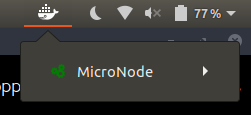

# MicroNode-Dockerized

Containerized Node micro-micro-service. A test to learn about docker.



Loosely guided by:
1. [NodeJS Dockerizing guide.](https://nodejs.org/en/docs/guides/nodejs-docker-webapp/)
2. [Open Liberty Docker guide.](https://openliberty.io/guides/docker.html#containerize-your-application)

## Writing a DockerFile

A docker image is built with your software on top of a prebuilt image with your prerequisites. For the development of this project, I am using Debian, so I chose the `node:10-stretch` image.

```
FROM node:10-stretch
WORKDIR /usr/src/app

# Install deps, copy source code.
COPY package*.json ./
RUN npm install
COPY . .

EXPOSE 7654 
CMD ["npm","start"]
```

## Building a Docker Image

Running `npm run dockerbuild` prepares a docker image using the following command:

```
docker build -t 'rcf/micronode' .
```

## Running a Docker Image

Running `npm run dockerrun` starts a docker container named *MicroNode* from the image `rcf/micronode`.

```
docker run --name 'MicroNode' -p 1000:7654 rcf/micronode
```

The `-p` command maps an *external* port to an *internal* port. Here, `localhost:1000` is mapped to port `7654` within the container.
